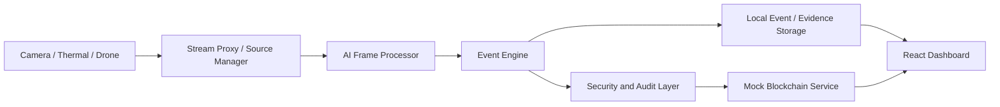

# DRISHTI AI

Integrated Border Surveillance & Intelligence Platform.

> This project is an academic/SIH prototype. Security and blockchain capabilities must be independently audited before production or operational deployment.

## Overview

DRISHTI AI is an advanced, AI-driven surveillance and intelligence platform designed specifically for continuous border monitoring and high-security perimeter defense. It supports IP/RTSP, Thermal, and Drone video processing.
It addresses unauthorized access and rogue device manipulation by implementing Zero-Trust Role-Based Access Control and a Device Trust Registry. It addresses digital evidence tampering by calculating SHA-256 hashes for evidence chain-of-custody and storing them in a mock blockchain ledger (SQLite-backed) for SIH presentation.

The current implementation is designed for SIH demonstration and development.

## Key Features

### AI and surveillance

- Standard camera processing
- Thermal processing (`Thermal-Imaging-Object-Detection`)
- Drone processing (`LEAF-YOLO`)
- Human detection
- Vehicle detection (`vehicle_detection_tracker`)
- Weapon detection (Partially implemented)
- Face recognition (`Face_Recognition_System`)
- ANPR (`main-gate-alpr`)
- Intrusion detection (`Intrusion-Detection`)
- Alert generation
- Event logging

### Cybersecurity

| Capability | Status | Implementation details | Evidence |
|---|---|---|---|
| Authentication | Implemented | JWT-based authentication, bcrypt hashing | `backend/services/auth_service.py` |
| Authorization/RBAC | Implemented | Roles via middleware (`require_role`) | `backend/api/auth.py` |
| MFA | Planned | Not currently implemented | None |
| Session security | Implemented | Access and refresh tokens with expiration | `backend/services/auth_service.py` |
| Device trust | Implemented | Registration, approval, suspension, and revocation | `backend/services/device_registry.py` |
| API protection | Implemented | Endpoint dependency checks for role-based access | `backend/api/routes.py` |
| Secure stream proxy | Partially implemented | Route `/proxy-stream` exists but lacks JWT validation | `backend/api/routes.py` |
| Security event logging | Implemented | Logging of failed logins, lockouts, unknown devices | `backend/services/auth_service.py` |
| Rate limiting | Planned | Not currently implemented | None |
| Input validation | Implemented | Pydantic schemas for request payloads | `backend/schemas/auth.py` |
| Secrets management | Implemented | Reading `JWT_SECRET` from `.env` | `backend/services/auth_service.py` |
| Evidence protection | Partially implemented | Evidence schema exists, export requests logged | `backend/services/evidence_manager.py` |
| Threat monitoring | Mock/demo | Basic risk score endpoint based on failed logins | `backend/api/security.py` |

### Blockchain and integrity

| Capability | Status | What is recorded | Storage location | Evidence |
|---|---|---|---|---|
| Event hashing | Planned | Not actively generated in current Event Engine | None | None |
| Evidence hashing | Implemented | Record ID, action, actor ID, evidence ID | SQLite (`evidence_chain_of_custody`) | `backend/services/evidence_manager.py` |
| Blockchain transaction | Mock/demo | Transaction ID, Entity, Hash, Previous Hash | SQLite (`blockchain_transactions`) | `backend/services/blockchain_service.py` |
| Hash verification | Implemented | Current hash compared against stored transaction hash | SQLite / API | `backend/api/blockchain.py` |
| Chain of custody | Implemented | Audit trail of evidence requests/approvals | SQLite | `backend/services/evidence_manager.py` |
| Access audit trail | Implemented | Login, Logout, API interactions (Registration) | SQLite (`access_audit_logs`) | `backend/services/auth_service.py` |
| Device identity ledger | Mock/demo | Device registration and revocation anchored to ledger | SQLite | `backend/services/device_registry.py` |
| AI model provenance | Partially implemented | AI Registry DB schema exists, GET endpoint only | SQLite | `backend/api/models.py` |
| Mock blockchain | Mock/demo | SHA256 deterministic hashes | SQLite | `backend/services/blockchain_service.py` |
| Permissioned blockchain | Planned | Branch code exists, missing real Hyperledger hook | None | None |

> The current repository uses a local/mock blockchain implementation or blockchain abstraction. A production permissioned blockchain network is not verified in this repository. Raw videos, face images, license plates, and personal data remain off-chain; only hashes are stored in the mock ledger.

## Architecture



Data flows from RTSP/IP cameras into the `SourceManager` and `FrameProcessor` where AI models identify threats. Detected anomalies are routed to the `EventEngine` and stored. Interactions with the system (logins, evidence exports, device approvals) are caught by the Security Layer and hashed into the `BlockchainService`, which defaults to a local mock table. 

## Cybersecurity Implementation

### Authentication
- **Purpose**: Prevent unauthorized access to the Command Center.
- **How it works**: Uses OAuth2PasswordBearer with JWT tokens and bcrypt password hashing. A default `admin` is seeded on startup.
- **Source files**: `backend/services/auth_service.py`, `backend/api/auth.py`
- **Token lifetime**: Access token (30 min), Refresh token (7 days).
- **Account lockout**: Locks account for 15 minutes after 5 consecutive failed logins.
- **MFA status**: The repository does not verify this capability.

### Authorization and roles
- **Purpose**: Restrict user privileges.
- **Roles Implemented**: `ADMIN`, `SECURITY_OPERATOR`, `INVESTIGATOR`, `COMMAND_AUTHORITY`, `AUDITOR`.
- **Enforcement**: Via FastAPI dependency `require_role([...])`.

### Device and camera security
- **Purpose**: Prevent rogue edge devices from spoofing streams.
- **How it works**: Devices must be registered via POST payload. Admin manually changes status to `ACTIVE`.
- **Status Enum**: PENDING, ACTIVE, SUSPENDED, COMPROMISED, REVOKED, OFFLINE.
- **Limitations**: Device heartbeat is a mock endpoint and does not enforce mutual TLS yet.

### API and stream security
- **Authentication Middleware**: Implemented via FastAPI `Depends(get_current_user)`.
- **CORS**: Wide-open `allow_origins=["*"]` configured for local development.
- **Secure Stream Proxy**: Proxies streams to bypass CORS (`/proxy-stream`), but lacks JWT validation currently.

### Security events and monitoring
- **Purpose**: Track active threats against the dashboard.
- **Event Types**: FAILED_LOGIN, LOCKED_ACCOUNT_LOGIN_ATTEMPT, ACCOUNT_LOCKOUT, UNKNOWN_DEVICE_HEARTBEAT, REVOKED_DEVICE_ACCESS, UNAUTHORIZED_ACCESS.
- **Endpoint**: `/api/security/risk-summary` calculates a 0-100 risk score based on active severe incidents.

### Evidence security
- **Chain of Custody**: When evidence export is requested, an entry is added to `evidence_chain_of_custody` and its SHA-256 hash is placed on the mock ledger.
- **Limitations**: Physical file encryption at rest is not implemented.

## Blockchain Implementation

### Blockchain service
- **Provider**: Custom abstraction `BlockchainService` simulating a ledger.
- **Status**: Mock/demo using SQLite `blockchain_transactions`.
- **Configuration variables**: `BLOCKCHAIN_MODE=MOCK`

### On-chain data
Only metadata is hashed:
- transaction_id
- entity_id
- entity_type
- transaction_type
- hash
- previous_hash
- timestamp

### Off-chain data
Sensitive items remain completely off-chain:
- Video clips
- Face images
- Passwords (hashed in DB)
- Incident descriptions

### Hash verification
1. The endpoint `/api/blockchain/events/{id}/verify` takes a client-provided `current_hash`.
2. It fetches the original anchored hash from `blockchain_transactions`.
3. It compares them directly.
4. Returns `{ verified: false, verification_status: "TAMPERED" }` on mismatch.

### Chain of custody
- Implemented Actions: REGISTER_DEVICE, EXPORT_REQUESTED, EXPORT_APPROVED.

## API Documentation

| Method | Endpoint | Authentication | Required role | Purpose | Status |
|---|---|---|---|---|---|
| POST | `/api/auth/login` | None | None | Get JWT tokens | Implemented |
| POST | `/api/devices` | Bearer | ADMIN | Register camera | Implemented |
| POST | `/api/devices/{id}/approve` | Bearer | ADMIN | Approve camera | Implemented |
| GET | `/api/security/risk-summary` | Bearer | ADMIN, AUDITOR, SECURITY_OPERATOR | Fetch threat metrics | Mock/Demo |
| GET | `/api/blockchain/transactions` | Bearer | ADMIN, AUDITOR | List mock ledger blocks | Implemented |
| POST | `/api/blockchain/events/{id}/verify`| Bearer | Any | Verify hash integrity | Implemented |
| POST | `/api/evidence/{id}/export-request`| Bearer | INVESTIGATOR, ADMIN | Dual-key export request | Implemented |

## Database and Data Models

Database: **SQLite** (`drishti.db`)

Models created by `db_manager.py`:
- `users`: Stores user credentials and lockouts.
- `devices`: Trust registry.
- `security_events`: Failed logins, API abuse attempts.
- `blockchain_transactions`: Mock ledger.
- `evidence_chain_of_custody`: Export authorization trail.
- `access_audit_logs`: General API request tracking.

## Configuration

| Variable | Required | Purpose | Safe example |
|---|---|---|---|
| JWT_SECRET | Yes | Encrypts JWT tokens | `super-secret-development-key` |
| BLOCKCHAIN_MODE | No | Toggles mock ledger | `MOCK` |
| SECURITY_RISK_THRESHOLD| No | UI threshold | `70` |

## Installation

**Backend Setup**
```bash
cd backend
python -m venv venv
source venv/bin/activate  # On Windows: venv\Scripts\activate
pip install -r requirements.txt
python main.py
```
*(On first boot, the system auto-migrates SQLite tables and creates an `admin` user).*

**Frontend Setup**
```bash
cd backend/frontend
npm install
npm run dev
```

## Demonstration Workflow

1. **Command**: Run Frontend and Backend.
2. **Command**: Login to UI with `admin` / `admin123`.
3. **UI Action**: Navigate to **Audit** page (Displays Mock Blockchain transactions).
4. **API Simulation**: Hit `POST /api/auth/login` multiple times with bad passwords.
5. **UI Action**: Navigate to **Security** page (Shows increased Risk Score and account lockout event).
6. **Command**: Hit `POST /api/blockchain/events/{id}/verify` with an incorrect hash.
7. **Expected Result**: System returns `TAMPERED`. (Uses mock blockchain functionality).

*(Note: Live camera inference tracking is partially disconnected from the mock ledger in this exact demonstration state).*

## Threat Model

| Threat | Asset | Attack path | Current mitigation | Status | Remaining risk |
|---|---|---|---|---|---|
| Unauthorized dashboard access | Command Center | Stolen credentials | RBAC, Account Lockout | Implemented | Session hijacking |
| Evidence modification | Video Clips | Malicious insider editing disk | Hash verification endpoint | Implemented | Mock ledger isn't decentralized |
| Camera impersonation | Live Feed | Rogue device on network | Device Trust Registry | Implemented | Lacks mTLS enforcement |

## Security Limitations
- Local/mock blockchain instead of a real permissioned network.
- No independent penetration testing.
- No hardware-backed device identity.
- No protection against adversarial AI inputs.
- No guaranteed camera tamper resistance.
- Stream proxy lacks token validation on media requests.

## Security Recommendations

### Required before production
- Change default admin passwords.
- Configure secure JWT secrets.
- Enable HTTPS/TLS certificates.
- Implement permissioned blockchain deployment (Hyperledger Fabric).
- Network segmentation for edge devices.

### Future development
- Hardware-backed device identity.
- Multi-agency blockchain channels.
- Model drift monitoring.

## Testing and Verification
Automated tests for cybersecurity capabilities were not found in the current repository. Security logic relies on manual endpoint verification during SIH demonstrations.

## Project Status

| Area | Status | Notes |
|---|---|---|
| AI surveillance | Partially working | Disconnected from new RBAC frontend temporarily |
| Authentication | Working | Fully functional JWT implementation |
| Authorization | Working | `require_role` implemented across new APIs |
| Device security | Working | Registry tracks states |
| API security | Working | Dependencies protect routes |
| Evidence integrity | Demo only | Hashes verify against mock SQLite ledger |
| Blockchain integration| Mock | Fallback SQLite implementation active |
| Chain of custody | Demo only | DB trail works, physical file link incomplete |
| Security monitoring | Working | UI dashboard aggregates events |
| Production readiness | Not verified | SIH Academic Prototype |
